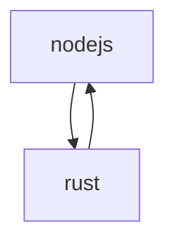

[Reference Video](https://youtu.be/kkc2Z_PI8E8?si=PWL1KIniwGUYXO-j)

### This project


#### FFI = Foreign Function Interface

### Before Run this

1.Go to `rust-project` and excute following
```bash
cargo run
```
```bash
cargo build --release
```
#### if needed run
```bash
cargo test
```
2.Go to `node-project` and excute following
```bash
npm i
```
[npm install ffi-napi](https://www.npmjs.com/package/ffi-napi?activeTab=readme)

3.For final result
```bash
node index.js
```

### Result


[Mesure Time in Nodejs](https://dev.to/saranshk/how-to-measure-javascript-execution-time-5h2#:~:text=The%20easiest%20way%20to%20track,the%20difference%20of%20the%20two.)

Make sure that your Rust code is compiled into a shared library (.dylib on macOS, .so on Linux, .dll on Windows) and that the path to the library is correctly specified in your Node.js script.